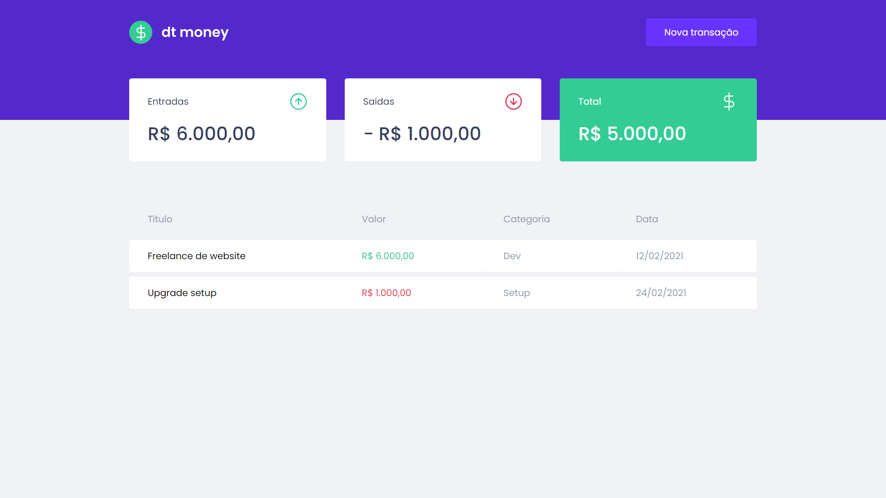
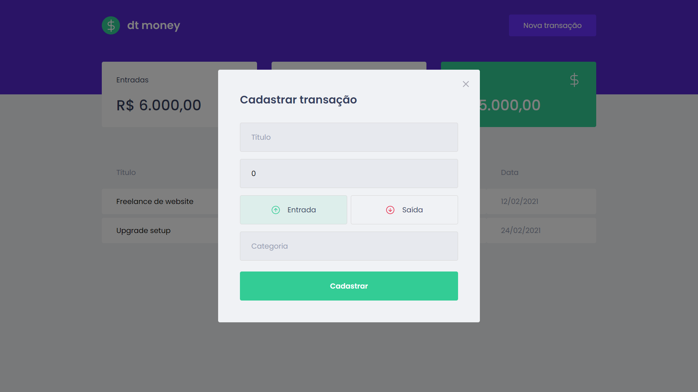

<p align="center">
   
</p>

<p align="center">
   <a href="https://www.linkedin.com/in/brfeitoza/">
      
   </a>
  
  
  
  
  <a href="mailto:bfeitoza634cyt@gmail.com">
   
  </a>
</p>

<p align="center">
  :moneybag: The goal of this project is provide you an easiest way to manage your money.
</p>

<p align="center" style="font-weight: bold;">Project developed during the second module of Ignite | <a href="https://rocketseat.com.br/">Rocketseat</a></p>

<div align="center">
  <sub> Made with 💖 by
    <a href="https://github.com/brfeitoza">Bruno Feitoza
  </sub>
</div>

# 📌 Contents

* [Screenshots](#camera-screenshot)
* [Technologies](#rocket-technologies)
* [How to Run](#computer-how-to-run)
* [Issues](#bug-issues)
* [Contributing](#sparkles-issues)
* [License](#page_facing_up-license)

# :camera: Screenshots
<div align="center">
   
   
</div>

# :rocket: Technologies
This project was made using the follow technologies:

* [React](https://reactjs.org/)
* [Typescript](https://www.typescriptlang.org/)
* [Styled Components](https://styled-components.com/)
* [Polished](https://polished.js.org/)
* [MirageJS](https://miragejs.com/)
* [Axios](https://github.com/axios/axios)
* [Husky](https://www.npmjs.com/package/husky)
* [Commitlint](https://github.com/conventional-changelog/commitlint)

# :computer: How to run

```bash
# Clone Repository
$ git clone https://github.com/brfeitoza/dt-money.git && cd dt-money

# Install Dependencies
$ yarn

# Run Aplication
$ yarn start
```
Go to http://localhost:3000/ to see the application running.

# :bug: Issues

Create a <a href="https://github.com/brfeitoza/dt-money/issues">new issue report</a>, it will be an honor to be able to help you solve and further improve our application.

# :sparkles: Contributing

- Fork this repository;
- Create a new branch to develop your feature: `git checkout -b my-feature`;
- Commit your changes: `git commit -m 'feat: my new feature'`;
- Push to your branch: `git push origin my-feature`.

# :page_facing_up: License

This project is under the [MIT License](./LICENSE) |
Made with 💖 by [Bruno Feitoza](https://www.linkedin.com/in/brfeitoza/).
